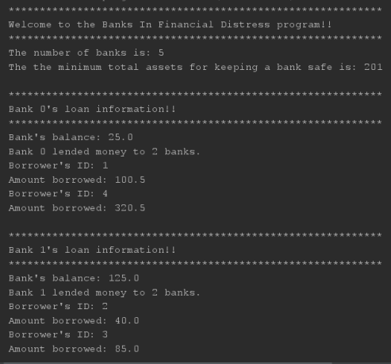
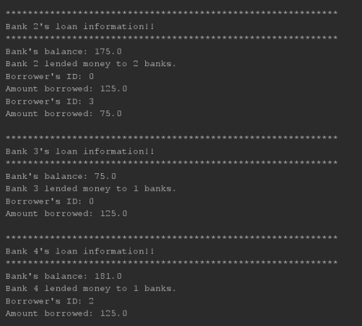
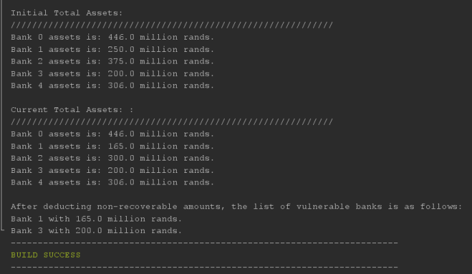

# Banks In Financial Distress Program

## Overview
The Banks In Financial Distress program simulates a scenario where five banks are evaluated for financial safety based on predefined parameters. This README provides an overview of the program structure and functionality.

## Program Structure
The program consists of two main classes:

### 1. BanksInFinancialDistress
- Initializes an instance of the EvaluateSafety class.
- Sets the number of banks (numberOfBanks) and the limit for keeping a bank safe (limitForKeepingBankSafe).
- Implements the main method to start the program by printing a welcome message and calling the startTheProgram method.

### 2. EvaluateSafety
- Manages the evaluation of banks for financial safety.
- Contains methods for initializing arrays, evaluating bank safety, handling unsafe loans, and printing results.
- The EvaluateSafetyBanks method is the core logic for evaluating bank safety. It initializes arrays, gathers information about borrowers and loans, calculates total assets, checks for unsafe banks, and prints results.
- Other methods like initializeArray, getBorrowers, calculateBankAssets, checkUnsafeBanks, handleUnsafeBank, and print methods are used for specific tasks within the evaluation process.

## How to Use
1. Compile the program using a Java compiler.
2. Run the BanksInFinancialDistress class, which will start the evaluation process.
3. Follow the program prompts and review the output to understand the safety status of banks based on predefined criteria.

## Sample Data

Bank 0's loan information!!
************************************************************
Bank's balance: 25.0
Bank 0 lent money to 2 banks.
Borrower's ID: 1
Amount borrowed: 100.5
Borrower's ID: 4
Amount borrowed: 320.5

Bank 1's loan information!!
************************************************************
Bank's balance: 125.0
Bank 1 lent money to 2 banks.
Borrower's ID: 2
Amount borrowed: 40.0
Borrower's ID: 3
Amount borrowed: 85.0

Bank 2's loan information!!
************************************************************
Bank's balance: 175.0
Bank 2 lent money to 2 banks.
Borrower's ID: 0
Amount borrowed: 125.0
Borrower's ID: 3
Amount borrowed: 75.0

Bank 3's loan information!!
************************************************************
Bank's balance: 75.0
Bank 3 lent money to 1 bank.
Borrower's ID: 0
Amount borrowed: 125.0

Bank 4's loan information!!
************************************************************
Bank's balance: 181.0
Bank 4 lent money to 1 bank.
Borrower's ID: 2
Amount borrowed: 125.0

## Sample Output

